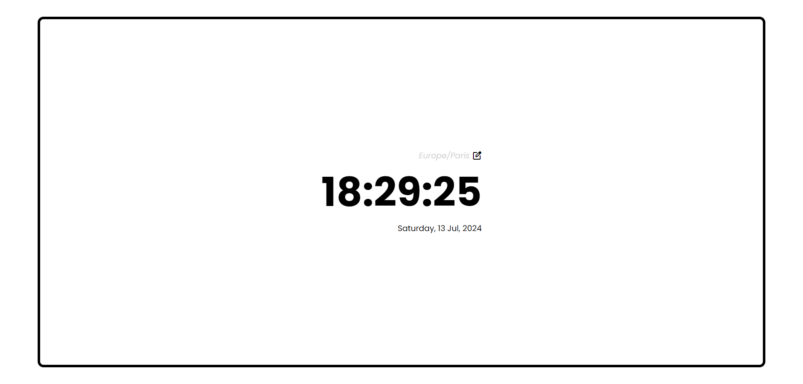
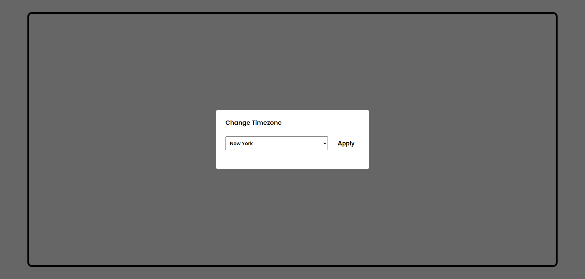
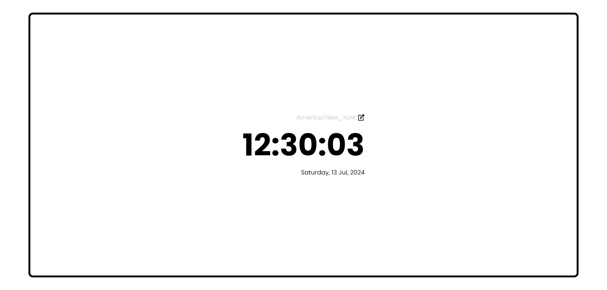
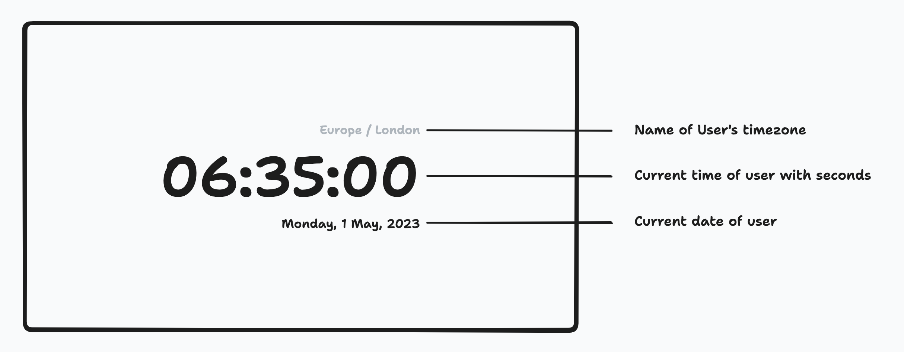
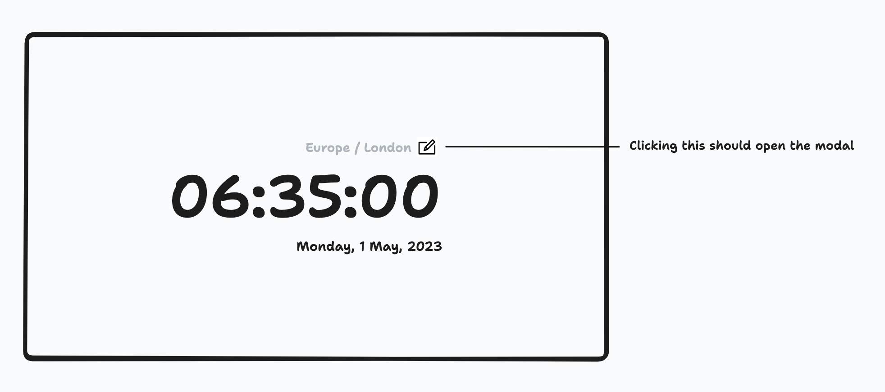
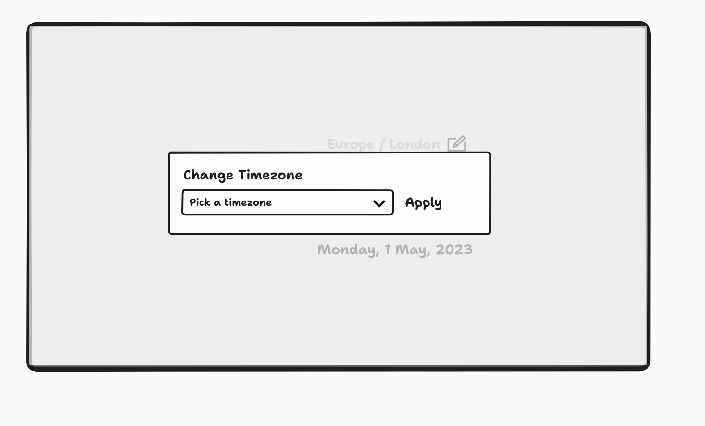

# Time Sync Application

This application displays the current date and time for a selected timezone.

Checkpoint : External packages from [roadmap.sh](https://roadmap.sh/full-stack)

 

## Features

  * Timezone Selection using a dropdown menu to select a timezone, with options for Lagos, Paris, New York, Tokyo, Sydney.
  * Current Time, Date and Time Zone Display

Install dependencies

* `npm install` or `yarn install`

Start the server

* `npm start` or `yarn start`

### Usage

* Open the application in your web browser: `http://localhost:3000`
* Create a new task by clicking the "Add Task" button
* Filter tasks using the search bar
* Sort tasks using the dropdown menu
* Edit or delete tasks as needed

  

## Getting Started

### Installation

Clone the project

* `git clone  https://github.com/404diaby/timeSync.git`

Go to the project directory

* ` cd timeSync`

Install dependencies

* `npm install --production`

Start the server 

* `npm run start` 

Or open `index.html` files in your browser

### Usage

* Open the application in your web browser: `http://localhost:3000`
* Click on icon to open a modal
* Select a timezone from the dropdown menu.
* Click the "Apply" button.
* The application will automatically update the current time every second.

## Preview

 

 

 

## Design
  ### Step 1
   
  ### Step 2
   
   
   
## Development

### Technologies Used

**Stacks** : JavaScript, CSS, HTML

**Externa packages** : 
 * Day.js: A lightweight JavaScript date library with timezone and UTC plugins.
 * Micromodal: A lightweight JavaScript library for modal dialogs.
 * Material Symbols Outlined: A font library for icons.

## Future Plans

###....
* explain script part for dev mode

## Acknowledgements

- [Dayjs - Documentation](https://day.js.org/docs/en/installation/installation)
- [Dayjs helpler](https://www.freecodecamp.org/news/javascript-date-time-dayjs/#dayjsapiandbasicsyntax)
- [Micromodal - Documentation](https://micromodal.vercel.app/#introduction)
- [Micromodal helper](https://gist.github.com/ghosh/4f94cf497d7090359a5c9f81caf60699)

## Social Links

## Demo

You can try out the TodoList App demo here: 

